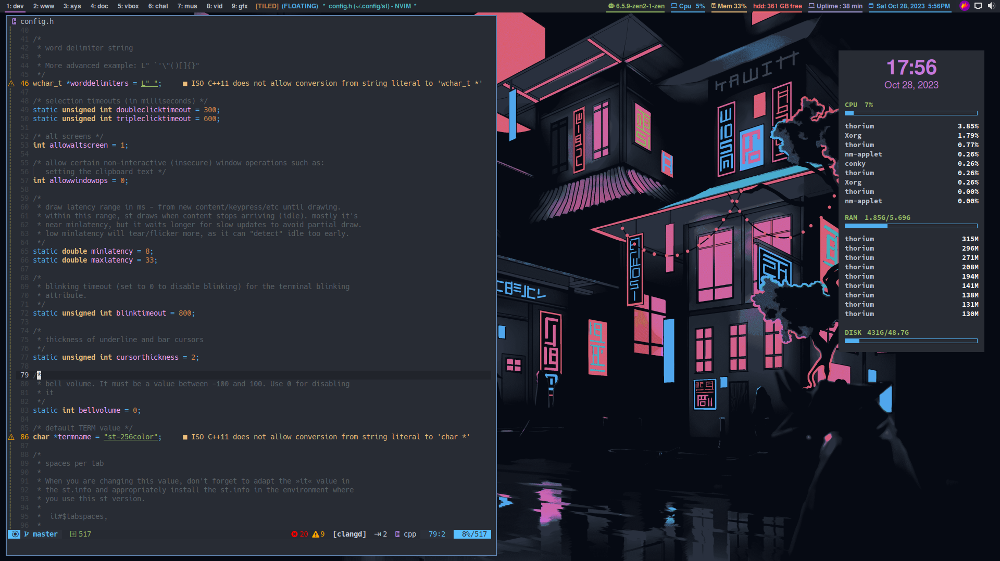

<div align="justify">
<h1>Dotfiles</h1>

<a>
</a>
<div align="left">
  
A lot of configs taken from dt and changed for my daily use
  
- **Window Manager** :[Bspwm](https://github.com/baskerville/bspwm)
- **Panel** :[Polybar](https://github.com/adi1090x/polybar-themes) With doom-one theme
- **Application Launcher** :[rofi](https://github.com/adi1090x/rofi/tree/master)
- **Desktop Notification** :[Dunst](https://github.com/dunst-project/dunst)
- **Terminal Emulator** :[st](https://gitlab.com/dwt1/st-distrotube.git)
- **Shell** :[bash](https://gitlab.com/dwt1/dotfiles.git)
- **File Manager** :[ranger](https://github.com/ranger/ranger)
- **TEXT EDITOR** :[Lunar Vim](https://github.com/LunarVim/LunarVim) With doom-one theme

<h2>INSTALLATION</h2>

**You can install with installation [script](https://github.com/GermanEmpire/dotfiles/releases/tag/script)**
```sh
chmod +x install.sh
./install.sh
```
