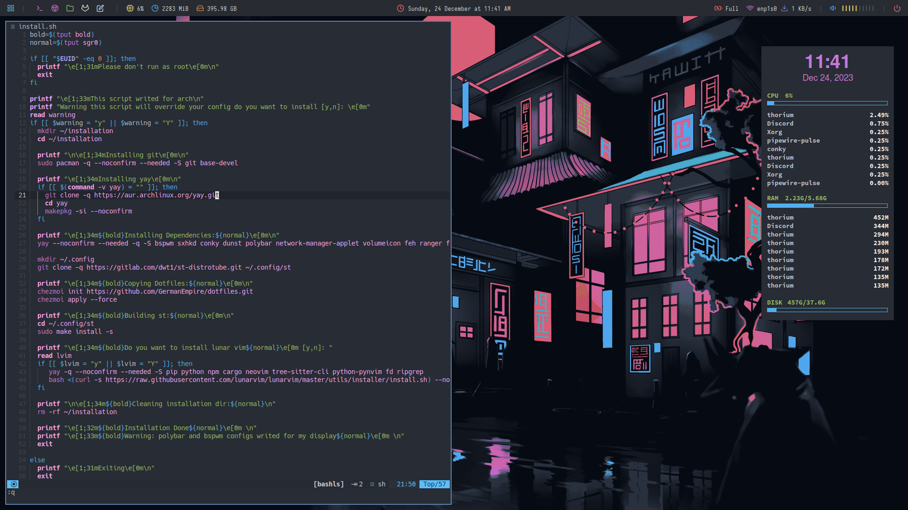

<div align="justify">
<h1>Dotfiles</h1>

<a>
</a>
<div align="left">
  
- **Window Manager** :     [Bspwm](https://github.com/baskerville/bspwm)
- **Panel** :              [Polybar](https://github.com/adi1090x/polybar-themes) With doom-one theme
- **Application Launcher**:[rofi](https://github.com/adi1090x/rofi/tree/master)
- **Desktop Notification**: [Dunst](https://github.com/dunst-project/dunst)
- **Terminal Emulator**:   [st](https://gitlab.com/dwt1/st-distrotube.git)
- **Shell**            :[bash](https://gitlab.com/dwt1/dotfiles.git)
- **Text Editor**:         [Lunar Vim](https://github.com/LunarVim/LunarVim) with doom-one theme

<h2>INSTALLATION</h2>

**You can install with installation scripts**

For arch
```sh
chmod +x install-arch.sh
./install-arch.sh
```
For debian
```sh
chmod +x install-debian.sh
./install-debian.sh
```
